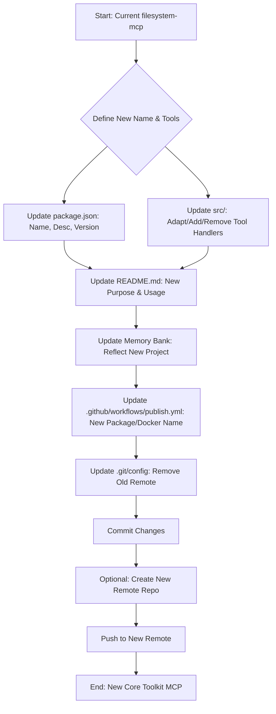

# Refactor Plan: Filesystem MCP to NexusTools Core Toolkit

## 1. Goal

Repurpose the existing `@shtse8/filesystem-mcp` project into a new MCP server
named "NexusTools". This server will provide a core set of efficient tools for
AI agents, including partial file reads and edits. The process involves
renaming, refactoring code, updating documentation/configuration, and setting up
a new Git remote.

## 2. Agreed Name

NexusTools

## 3. Agreed Core Toolset

- **`list_files`**: List files/directories (potentially simplified from original
  `glob` implementation).
- **`stat_items`**: Get status information for specified paths.
- **`read_content`**: Read content from files, adding optional `start_line` and
  `end_line` parameters for partial reads.
- **`write_content`**: Write or append content to files.
- **`replace_content`**: Perform search/replace operations within files.
- **`create_directories`**: Create directories.
- **`delete_items`**: Delete files or directories.
- **`move_items`**: Move/rename files or directories.

_(Tools like `chmod_items` and `chown_items` will be removed)._

## 4. High-Level Plan Diagram

## 5. Detailed Steps

1. **Update `package.json`:** Change `name` to `@your-scope/nexus-tools` (or
   similar), `description`, `version` (reset to `0.1.0`), and the `bin` command
   name. Adjust dependencies if needed.
2. **Refactor Source Code (`src/`)**:
   - Rename/modify handler files according to the new toolset.
   - Implement partial reads in `read_content`.
   - Remove code for discarded tools (`chmod`, `chown`).
   - Update `index.ts` with the new tool definitions and schemas.
3. **Update Documentation:**
   - Rewrite `README.md` for "NexusTools".
   - Update all Memory Bank files (`projectbrief.md`, `productContext.md`,
     `activeContext.md`, `systemPatterns.md`, `techContext.md`, `progress.md`)
     to reflect the new project identity. Reset `progress.md` and
     `activeContext.md`.
4. **Update CI/CD:** Modify `.github/workflows/publish.yml` for the new
   package/Docker names.
5. **Update Git Config:** Remove the current `origin` remote
   (`git remote remove origin`).
6. **Commit:** Stage and commit all changes locally.
7. **(Optional) New Repository:** Create a new repository on GitHub (or another
   platform).
8. **(Optional) Add New Remote:** Add the new repository URL as the `origin`
   remote.
9. **(Optional) Push:** Push the committed changes to the new remote repository.

## 6. Next Step (Implementation)

Switch to "Code" mode to begin implementation, starting with `package.json`
updates and removing the old Git remote.
